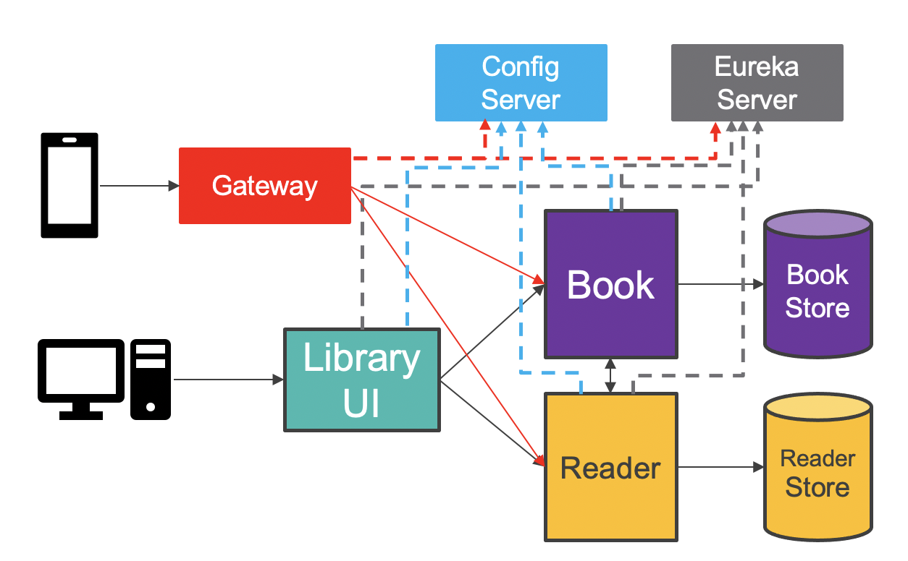
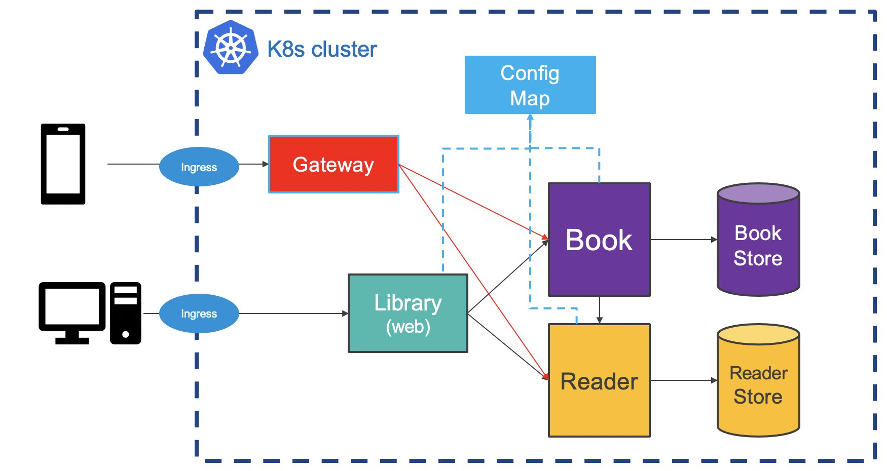

# Example of microservice-based application running on Kubernetes

This demo aims to show how easy is to deploy your microservices onto Kubernetes, if you need to, so long as you have developed them using the [Spring Cloud](https://spring.io/projects/spring-cloud) projects: **Spring Cloud Netflix**, **Spring Cloud OpenFeign**, **Spring Cloud Config** and **Spring Cloud Gateway**.  

Here are the original microservices deployed using **Spring Cloud** projects:

  

No changes in the Feign interfaces are required. We just need to remove the dependencies on Spring Cloud Netflix and Spring Cloud Config and add the following one to **Spring Cloud Kubernetes** to our `build.gradle` file as follows:

<code>implementation 'org.springframework.cloud:spring-cloud-starter-kubernetes-client-all'</code>

Beyond that, the only change required in the whole codebase is to annotate the *Spring Boot application class* with `@EnableDiscoveryClient` to enable K8s-native Service Discovery:

<code>@EnableFeignClients</code>  
<code>@EnableDiscoveryClient</code>  
<code>@SpringBootApplication</code>  
<code>public class BookApplication {</code>  
<code>// ...</code>  
<code>}</code>  

Spring Cloud Feign uses **Spring Cloud LoadBalancer** that, when running on Kubernetes, leverages *Discovery Client for Kubernetes* to check for service instances. As a result, it only chooses from instances that are up and running. The only requirement is to align the Kubernetes service name with `spring.application.name` property:

*application.properties(yaml)*:  
<code>spring.application.name=library-book-service</code>

combined with the following Kubernetes configuration:

<code>$ kubectl get svc:</code>  
<code>NAME                       TYPE        CLUSTER-IP       EXTERNAL-IP   PORT(S)             AGE</code>  
<code>library-book-service       ClusterIP   10.100.200.235   <none>        8080/TCP            5d21h</code>   

Each service queries the K8s API to discover all the others and starts automatically using *client-side load balancing*. The applications' configuration can keep being externalised and stored in **Kubernetes config maps**. We therefore just need to deploy our *API Gateway*.  

  

The front-end service will configure its home page when running on Kubernetes.  
Different Application Instances (containers) will render the UI using different background colors, up to 4 different colors.

You can generate 10 readers at a time clicking on the *Load Readers* button.  
You can generate 100 books at a time clicking on the *Load Books* button. The first 40 books will be evenly borrowed by some readers.  
You can visualise the list of readers and books following the corresponding links. Use the browser's back button to return to the home page.  

## Build:

The build process requires that your workstation have both **Docker** (used by *gradle bootBuildImage* ) and **Maven** (used by *Spring Cloud Contract*) installed.   
Execute the `./scripts/build.sh` script to build everything and push the newly built containers to your container registry. Make sure you are logged in your registry through `docker login` before starting. The example below is using *Harbor*:  

<code>$ ./scripts/build.sh &lt;HARBOR-URL&gt;/&lt;PROJECT&gt;</code>

## Deploy and run on K8s:  

You are going to need both **kubectl** and **helm** installed on your workstation. Make sure you are connected to your Kubernetes cluster before starting. The installation will create a *library namespace* to hold everything.

1. Run <code>./scripts/init.sh &lt;CONTAINER-REGISTRY-URL&gt;</code> and be patient. It will take some time but everything will be deployed and configured, including a public IP address assigned to the newly created ingress controller exposing the UI application. If you want to add **Spring Cloud Gateway for Kubernetes** integrated with **API Portal** to your deployment, after downloading both products from the [VMware Tanzu Network](https://network.pivotal.io), run instead <code>./scripts/init-api.sh &lt;PATH-TO-SCG4K8s-INSTALL-DIR&gt; &lt;PATH-TO-API-PORTAL-INSTALL-DIR&gt; &lt;CONTAINER-REGISTRY-URL&gt;</code>, passing in  
   1. &lt;PATH-TO-SCG4K8s-INSTALL-DIR&gt;: path to the Spring Cloud Gateway directory
   2. &lt;PATH-TO-API-PORTAL-INSTALL-DIR&gt;: path to the API Portal directory
   3. &lt;CONTAINER-REGISTRY-URL&gt;: URL to the registry where the built images have been uploaded to

2. Use the published IP address (or hostname if you have configured one) to access the application running on Kubernetes. You will notice that the application has detected it is running on K8s :)  

3. Generate some data clicking on *Load Readers* and *Load Books* buttons.  

4. Scale out the front-end application running <code>kubectl scale --replicas 3 deploy library-msa -n library</code>. You can notice the UI background color changing as you reload the page.  

5. Stop the **Reader** service instance running <code>kubectl scale --replicas 0 deploy library-reader-service -n library</code>.  

6. You can verify that the **Reader** service instance is gone clicking on the *List of Readers* link on the home page. The list shows up empty.  

7. Navigate to the *List of Books* page. Borrow a book to some reader who hasn't yet borrowed any books. The operation is to succeed despite the **Reader** service being down. This is the *circuit breaker pattern* in action.

8. (Optional) If you have installed **Spring Cloud Gateway** on step 1, you can now access the back-end services' RESTful APIs through the **API Gateway**. For example, assuming you have assigned the `gateway.library.example.com` hostname to your gateway, you can now retrieve the list of books running  
<code>http gateway.library.example.com/library-book-service/books</code>  
You can also access the **API Portal** and inspect all RESTful APIs published by the back-end services. 

## Cleaning up:

9. Run either <code>./scripts/cleanup.sh</code> or <code>./scripts/cleanup-api.sh</code> depending on whether or not you deployed **API Gateway** and **API Portal** on step 1.  

## Build and Deploy using Tanzu Build Service (TBS):

You are also going to need **curl**, the [kp cli](https://network.pivotal.io/products/build-service/) and the [VMware Carvel](https://carvel.dev) tools installed on your workstation to go through this section.

[TBS](https://docs.pivotal.io/build-service/1-2/), which is a commercial product based on the amazing [kpack project](https://github.com/pivotal/kpack), is going to detect any changes on the source code stored in the git repo and automatically trigger the image building process. It is also going to rebuild the images in case of changes on the buildpacks or OS stacks being used.

You need access to a Kubernetes cluster where to install TBS on. The image building process is resource intensive so I recommend a cluster with 3x large worker nodes (4 cores, 16GB RAM and 100GB ephemeral disk).

Execute the `./scripts/init-tbs.sh` script to install TBS and configure it to immediately start building the microservice images out of the source code. It will then upload the built images to your *Harbor registry*. Here is an example of use:

<code>$ ./scripts/init-tbs.sh harbor.system.richmond.cf-app.com msa ./harbor-ca.crt admin &lt;harbor-pwd&gt; &lt;tanzu-net-usr&gt; &lt;tanzu-net-pwd&gt; https://github.com/dbaltor/library-k8s-msa.git</code>

It's possible to follow the building process of the images using the following command:

<code>kp build list -n library-tbs</code>

You might want to clone this repo if you would like to trigger the image building process by committing changes to your own repo.

## Cleaning up:

Run <code>./scripts/cleanup-tbs.sh</code> to remove TBS from your cluster.

If the removal process fails for any reason, try to run the <code>./tbs/delete-orfan-resources.sh</code> script after uncommenting the lines at the bottom corresponding to the namespaces still hanging around.

## Continuous Integration - Automating TBS building with Concourse:

The value of cloud-native apps is fully realised only when we can deploy new releases with the push of a button. So why not to integrate the building image process into our CI/CD pipelines. Here I am going to use the amazing [Concourse CI](https://concourse-ci.org).

Having already installed TBS in the previous section, all you need to do is to run the script below. It is going to install Concourse on your cluster and set your pipeline to test your microservices, build the images and deploy the apps.

<code>./scripts/init-ci.sh</code>

After executing all the steps required by the script above, you can access the Concourse web UI at http://concourse-web.concourse.svc.cluster.local:8080/teams/main/pipelines/library-msa and see your pipeline working as showed below.

  

After the initial execution to finish, you can test your new pipeline in action practicing CI/CD.  
Go to the <code>application/src/main/resources/templates/Index.html</code> file and find the following line of code:

<code>&lt;img th:src="@{k8s.png}" width="200" height="200"/&gt;</code>  

Change the image reference from *k8s.png* to *tanzu.png* as per below:

<code>&lt;img th:src="@{tanzu.png}" width="200" height="200"/&gt;</code>  

Save the file, commit and push the change. The pipeline should restart its work after some seconds. If that doesn't happen, *please make sure the pipeline is not paused*. Wait for the full conclusion which is going to take some minutes and then refresh the application home page to see the change. **Long live to DevOps!**

*IMPORTANT NOTICE*  
You can run all the other sections on the Kubernetes ditro of your choice, but as of the time of writing the [concourse-kpack-resource](https://github.com/vmware-tanzu/concourse-kpack-resource) I used in the Concourse pipeline only works with [TKGI](https://docs.vmware.com/en/VMware-Tanzu-Kubernetes-Grid-Integrated-Edition/index.html) or [GKE](https://cloud.google.com/kubernetes-engine) clusters.

## Cleaning up:

Run <code>./scripts/cleanup-ci.sh</code> to remove Concourse from your cluster.

## Architectural Decisions:  

* The application follows the *microservice architecture pattern* and the back-end services are accessible through *RESTful APIs*. The front-end service implements the *Model-View-Controller (MVC) architectural pattern* which is made easy by the **Spring framework**.   

* The front-end service can easily consume the back-end's RESTful APIs thanks to the declarative model offered by the **Spring Cloud OpenFeign** project.  

* This microservice architecture leverages *service discovery*, *client-side load balancing*, *externalised configuration* and *API gateway*, all made possible through **Spring Cloud** projects.  

* SQL databases have been chosen as data stores. Both **Reader** and **Book** services use H2 embedded in-memory database by default or PostgreSQL when deployed on Kubernetes. The codebase is made agnostic to the database being used through the lightweight, DDD-inspired **Spring Data JDBC** project.
